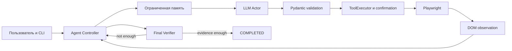

# Autonomous Browser AI Agent

Python-агент принимает произвольную задачу и управляет видимым Chromium. На каждом шаге LLM
выбирает один универсальный tool по текущей странице; Python проверяет аргументы и выполняет
действие через Playwright. Заранее заданных сценариев по словам задачи нет.

**Статус:** браузер, инструменты, цикл с тестовым провайдером и официальный SDK с HTTP mock
проверяются автоматически. Реальный LLM-вызов и автономное выполнение на публичном сайте
требуют API-ключа и пока не подтверждены. Точные результаты: [TEST_REPORT.md](TEST_REPORT.md).

## Установка и запуск

Python 3.11+. PowerShell из корня проекта:

```powershell
python -m venv .venv
.\.venv\Scripts\python.exe -m pip install -e ".[dev]"
.\.venv\Scripts\python.exe -m playwright install chromium
Copy-Item .env.example .env
```

Откройте `.env` в редакторе и задайте `LLM_API_KEY`. Ключ не нужно вводить в команду терминала,
отправлять кому-либо или коммитить. Уже созданная здесь `.venv` готова к работе.
На Linux/macOS используйте `.venv/bin/python`; для системных библиотек Chromium может понадобиться
`python -m playwright install --with-deps chromium`.

```dotenv
LLM_PROVIDER=openai
LLM_MODEL=gpt-4.1-mini
LLM_API_KEY=ваш_ключ_только_в_локальном_файле
HEADLESS=false
MAX_STEPS=30
```

```powershell
.\.venv\Scripts\python.exe -m browser_agent
```

Открывается Chromium, терминал спрашивает задачу. Видны шаг, домен, tool, target ID, результат,
ошибки, число сжатых шагов, latency и tokens. Chain-of-thought не запрашивается.
Браузер остаётся открытым до Enter. `/stop`, EOF или Ctrl+C останавливают работу.
Статусы: `COMPLETED`, `NEEDS_INPUT`, `STOPPED`. Завершённая задача даёт exit code 0,
остановка/необходимость ввода — 2, Ctrl+C — 130.

Без ключа можно проверить настоящий браузер:

```powershell
.\.venv\Scripts\python.exe -m browser_agent --check
```

CLI также поддерживает `--task`, `--start-url`, `--headless`, `--login`, `--dry-run`,
`--close-on-finish`; полная справка: `python -m browser_agent --help`.

## Demo

Безопасный [TodoMVC demo Playwright](https://demo.playwright.dev/todomvc/), новый профиль:

> Открой https://demo.playwright.dev/todomvc/. Добавь три задачи: «Прочитать README»,
> «Запустить тесты», «Записать демонстрацию». Отметь «Прочитать README» выполненной.
> Покажи только активные задачи. Сообщи, какие две задачи остались и сколько их.

В `conservative` Enter в неоднозначной форме требует `YES`. Для этого учебного demo можно
сознательно выбрать `SAFETY_MODE=balanced`, доверив первичную оценку риска модели.
Не переносите такой выбор бездумно на реальные аккаунты. [Сценарий видео](DEMO_SCRIPT.md).

Другой UI для проверки переноса навыков:

> На https://books.toscrape.com/ найди раздел Travel, сравни первые два товара,
> открой их карточки, сообщи полные названия, цены и какой дешевле. Ничего не покупай.

Это примеры пользовательских задач, не встроенные workflows. Каталог используется для чтения;
работоспособность полноценного checkout не предполагается.

## Features

Observe/decide/act loop; strict native function calls; bounded context; Actor + final Verifier;
runtime IDs; frames, открытый shadow DOM и новые вкладки; error recovery; loop detection;
human confirmation; persistent session; operational logging; детерминированные тесты.

## Architecture



## Как работает цикл

1. CLI загружает настройки и отдельный browser profile, получает произвольный goal.
2. `observe()` снимает страницу; `ContextMemory.build()` собирает ограниченный JSON.
3. `OpenAIProvider.decide()` получает один native function call через Responses API.
4. Имя и аргументы проверяются `TOOL_MODELS`/Pydantic; никакого `eval` и кода от модели.
5. `ToolExecutor` применяет safety policy и при необходимости запрашивает одноразовое `YES`.
6. Playwright выполняет действие. В память записывается результат, затем страница считывается заново.
7. `ask_user` уточняет данные; `finish` направляется отдельному verifier со свежим observation.
8. Успех подтверждается evidence; ошибки и лимиты приводят к явной остановке.

## Page understanding

`extract.js` читает видимый DOM, открытые shadow roots и до 10 frames. Извлекает роли,
aria/labels, placeholder, тип, состояние, варианты select и короткий окружающий текст.
Это приближение accessibility semantics, **не полное accessibility tree браузера**.
Скрытые элементы, script/style и невидимая часть страницы исключаются. CSS-прозрачные
native checkbox/radio с полноценной областью клика поддерживаются общим правилом.

ID `s4-e12` действует для одного observation. Python хранит `ElementHandle` конкретного узла.
Проверяет вкладку, URL, видимость, наличие и подпись узла. Замена React-узла или изменение смысла
кнопки вызывает stale error и повторное наблюдение. Модель не передаёт CSS/XPath/JavaScript.
Playwright обычно рекомендует Locator; pinned handle здесь выбран, чтобы locator не перенаправил
одобренный клик на другой узел. Цена — больше stale ошибок на динамических страницах.

По умолчанию: 70 элементов, 9000 символов текста, 18000 символов метаданных элементов.
Обрезка обозначается warning; агент может прокрутить страницу. Больше данных — меньше пропусков,
но выше стоимость, latency и шум. Скролл вложенных контейнеров пока не поддерживается.

## Универсальные tools

| Tool | Назначение |
|---|---|
| `navigate(url)` | HTTP(S) переход |
| `click(element_id, risk)` | Клик по наблюдаемому элементу |
| `type_text(element_id, text)` | Замена текста поля |
| `select_option(element_id, value)` | Выбор native select |
| `scroll(direction, amount)` | Прокрутка основного документа |
| `go_back()` | Назад |
| `wait(milliseconds)` | Явное ожидание 100–2000 мс |
| `press_key(element_id, key, risk)` | Клавиша из ограниченного списка |
| `switch_tab(tab_id)` | Существующая вкладка |
| `record_fact(quote)` | Точная цитата и её URL |
| `ask_user(question)` | Сведения или ручная помощь |
| `finish(summary, evidence)` | Итог для проверки |

## Context management

`context.py`: исходная цель, до 8 последних ответов пользователя, 6 последних подробных receipts,
12 сокращённых старых receipts и 12 цитат с URL. При переполнении recent старый шаг превращается
в короткую запись tool/target/result/source. Это детерминированное сжатие журнала, не LLM-summary.
Аргументы `type_text` не сохраняются в истории. Целые старые страницы не накапливаются.

`record_fact` принимает только точную подстроку текущего visible text. Это доказательство наличия
текста на странице, не достоверности сайта. Старые записи ограниченной памяти вытесняются:
важные незафиксированные сведения могут быть потеряны.

Сериализованный контекст ограничивается 48000 символами. При переполнении отбрасываются старые
receipts, затем recent, последние элементы и старые цитаты; исходная цель и ответы сохраняются.
Это символьный бюджет, не точные tokens; API usage логируется отдельно.
`previous_response_id` не используется: каждый вызов получает явный контекст без скрытой истории.

## Advanced pattern: Actor + final Verifier

При `finish` в `agent.py` берётся свежее наблюдение и вызывается `provider.verify()`.
У verifier другой prompt и одна схема `verification(complete,evidence,feedback)`.
Отказ возвращается Actor как feedback; три отклонения останавливают запуск.
Тест намеренно предлагает ранний ложный finish и проверяет, что выполнение продолжается.
Отдельный planner не добавлен: нет лишнего вызова перед каждым click.
Trade-off: дополнительная стоимость при завершении; та же модель способна повторить ошибку Actor.
Это дополнительная проверка, а не гарантия истины.

## Error recovery

Browser side effect не повторяется автоматически: действие могло сработать до таймаута.
Вместо этого ошибка попадает в context, страница считывается снова, модель меняет действие.
Для API connection/timeout/429/5xx — максимум 3 попытки, backoff 0,5 и 1 секунда.
Прочие 4xx завершают запуск. Четыре последовательные ошибки решения/наблюдения/действия — stop.

Три одинаковые комбинации action/state или восемь неизменных состояний дают один replan;
повторное обнаружение цикла — stop. Runtime IDs исключены из fingerprint. `MAX_STEPS`
ограничивает весь цикл. Новые вкладки обнаруживаются автоматически; закрытая заменяется оставшейся.
JS dialogs отклоняются, их ручное прохождение может потребовать `ask_user`.

## Safety / Prompt injection limitations

`safety.py` использует risk модели, общие признаки отправки/покупки/удаления и консервативное
правило для неоднозначных controls. В `conservative` неизвестные кнопки, Enter/Space и select
могут запросить `YES`. Обычные HTTP-ссылки, поиск, текстовый ввод и checkbox чаще автоматические.
В `balanced` остаются risk и словарная проверка. Сайт может скрывать побочный эффект в GET,
ссылке, input/change или checkbox: это эвристики, не полный security sandbox.

`YES` разрешает одно действие. До/после ответа сравнивается локальный hash текста/формы/target;
изменение аннулирует согласие. Это уменьшает риск устаревшего подтверждения, но не делает сайт
атомарной транзакцией. `--dry-run` останавливается перед первым предложенным browser action,
а не симулирует весь сценарий. Начальный `--start-url` при этом всё же открывается.

System prompt отделяет инструкции от недоверенных страниц, URL, названий и цитат.
Нет инструментов чтения файлов, environment, shell или произвольного JS. Ключ не передаётся LLM;
дополнительно вырезается из входа и блокируется в выходе провайдера. Password/OTP/card fields
скрываются и заполняются вручную. Остальной видимый контент и обычные поля передаются провайдеру:
это не универсальная DLP. Prompt injection полностью не решён. Domain allowlist и сетевого
sandbox нет. Для первого demo используйте отдельный профиль и безопасный учебный сайт.

Логи: run ID в имени, шаг, домен, tool/target, статус, тип ошибки, latency/tokens.
Полные URL с query, введённые значения, пароли, задачи, страницы и сырые API ошибки не логируются.
`.env`, browser profile, логи и артефакты исключены из Git. Playwright tracing не включён.

## Авторизация и session

```powershell
.\.venv\Scripts\python.exe -m browser_agent --login --start-url "https://нужный-сайт/"
```

Войдите вручную и нажмите Enter. Следующий запуск с тем же `PROFILE_DIR` использует cookies и
localStorage persistent context. Не используйте один профиль двумя процессами. Это отдельный
профиль агента, не личный Chrome. MFA/CAPTCHA решаются вручную, session может истечь.

## Configuration

Версии проверенного окружения закреплены в `requirements.lock`. Для их воспроизведения:
`python -m pip install -r requirements.lock`, затем `python -m pip install -e . --no-deps`.

При предельном размере контекста дополнительно сокращаются текст страницы и список вкладок.
Если один пользовательский контекст превышает безопасный бюджет, запуск завершается ошибкой
валидации; слишком большой запрос не отправляется провайдеру.

| Переменная | Default | Значение |
|---|---|---|
| `LLM_PROVIDER` | `openai` | Один реализованный provider path |
| `LLM_MODEL` | `gpt-4.1-mini` | Модель с strict tools |
| `LLM_API_KEY` | пусто | Также принимается `OPENAI_API_KEY` из среды |
| `LLM_BASE_URL` | SDK default | Endpoint должен поддерживать **Responses**, не только Chat Completions |
| `HEADLESS` | `false` | Видимый Chromium |
| `MAX_STEPS` | `30` | 1–200 итераций |
| `ACTION_TIMEOUT_MS` | `8000` | Лимит действия |
| `NAVIGATION_TIMEOUT_MS` | `20000` | Лимит перехода |
| `LLM_TIMEOUT_SECONDS` | `45` | Лимит API-запроса до retry |
| `PROFILE_DIR` | `.browser-profile` | Отдельная сохранённая сессия |
| `MAX_TEXT_CHARS` | `9000` | Текст observation |
| `MAX_ELEMENTS` | `70` | Количество элементов |
| `RECENT_HISTORY` | `6` | Подробные последние шаги |
| `SAFETY_MODE` | `conservative` | Также `balanced` |

Наличие `LLM_BASE_URL` не гарантирует совместимость любого «OpenAI-compatible» сервиса.

## Testing

```powershell
.\.venv\Scripts\python.exe -m pytest -q
.\.venv\Scripts\ruff.exe check .
.\.venv\Scripts\ruff.exe format --check .
```

Основной набор: unit + HTTP-mock официальный SDK + настоящий Chromium на локальном HTML.
После установки браузера этот набор не требует API/внешней сети. Дополнительно:

```powershell
$env:RUN_PUBLIC_TESTS="1"
.\.venv\Scripts\python.exe -m pytest tests/test_public.py -q
Remove-Item Env:RUN_PUBLIC_TESTS
$env:RUN_LIVE_TESTS="1"
.\.venv\Scripts\python.exe -m pytest tests/test_live.py -q
Remove-Item Env:RUN_LIVE_TESTS
```

Live test требует ключа и оплачиваемого доступа; он не заменяется mock автоматически.
Для видимого тестового браузера: `$env:TEST_HEADFUL="1"`.
Fixture-specific provider в `tests/test_agent.py` используется только тестом, не production CLI.
Выдавать его за автономную LLM-демонстрацию нельзя.

## Design decisions / Limitations

Playwright: asyncio, auto-wait, frames, вкладки и persistent context. DOM-first дешевле
обязательной обработки screenshots. Native SDK и небольшой цикл легче объяснить, чем лишний framework.
MCP для одного процесса не нужен; [MCP_STUDY.md](MCP_STUDY.md) объясняет возможное расширение.

Ограничения: CAPTCHA/bot protection, canvas, закрытый shadow DOM, неполные accessibility semantics,
сложные widgets, hover/drag/drop, uploads/downloads, вложенный scroll, очень большие формы,
ошибки модели и потеря старых сведений. Универсальность primitives не гарантирует любой сайт.

За следующую неделю: live eval с метриками успеха/стоимости, vision fallback, строгая policy
доменов/действий, улучшенный verifier, optional tracing с защитой персональных данных.
Это планы, не реализованные возможности.

## Защита проекта

Начните с [PROJECT_DEFENSE.md](PROJECT_DEFENSE.md), затем `agent.py` → `models.py` → `llm.py`
→ `browser.py` → `observation.py`/`extract.js`. [INTERVIEW_GUIDE.md](INTERVIEW_GUIDE.md)
разбирает 80 тем. Сверяйте рассказ с [TEST_REPORT.md](TEST_REPORT.md).

## Официальные источники

- [OpenAI function calling](https://developers.openai.com/api/docs/guides/function-calling)
  — Responses tools и strict schemas.
- [GPT-4.1 mini](https://developers.openai.com/api/docs/models/gpt-4.1-mini) — настраиваемый default.
- [Playwright ElementHandle](https://playwright.dev/python/docs/api/class-elementhandle)
  — привязка к узлу и отличие от Locator.
- [Playwright BrowserContext](https://playwright.dev/python/docs/api/class-browsercontext)
  — события страниц и жизненный цикл контекста.
