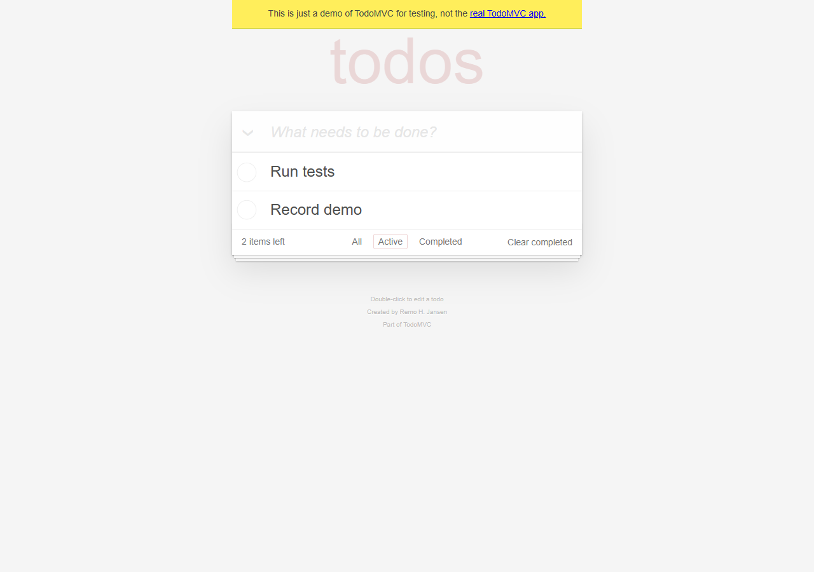

# Настоящие автономные прогоны

Модель **gpt-5.5 через официальный Codex CLI 0.139.0**, 21 сентября 2026.
В обоих случаях Python сам получает решение модели и управляет видимым Chromium.
Ручных вмешательств — **0**. Никаких записанных последовательностей действий в runtime нет.

## 1. Изменение списка задач

[Смотреть MP4](demo.mp4) · [исходный WebM](todo-full.webm) · [JSON результата](todo-result.json).

Цель: открыть TodoMVC; добавить `Read README`, `Run tests`, `Record demo`; отметить
`Read README` выполненной; оставить фильтр Active и сообщить оставшиеся задачи.

**Результат:** 10 шагов, 132,28 секунды. Остались `Run tests` и `Record demo`, счётчик 2.
В JSON сохранён исходный ответ модели; детали подтверждены её `finish.evidence` и состоянием UI.

## 2. Сравнение двух товаров на другом сайте

[Смотреть MP4](books.mp4) · [исходный WebM](books-full.webm) · [JSON результата](books-result.json).

Цель: на Books to Scrape найти Travel, открыть карточки первых двух книг, сравнить полные
названия и цены и указать разницу. Ничего не покупать.

**Результат:** 9 шагов, 123,42 секунды. `It's Only the Himalayas` — £45.17;
`Full Moon over Noah’s Ark: An Odyssey to Mount Ararat and Beyond` — £49.43.
Первая дешевле на **£4.26**. Цитаты обеих карточек с URL сохранены в JSON.
Агент сам исправил одну неточную цитату после отказа проверки.

## Как сделана запись

Playwright `record_video_dir`, полный запуск от открытия браузера до его закрытия.
MP4 — перекодирование исходного WebM для удобства просмотра: без вырезания ошибок,
ускорения и добавления вымышленных действий. Это два отдельных запуска, не склеенный сценарий.
Видна страница браузера; цель и машинные результаты приведены рядом с роликом.

Если GitHub показывает Download вместо плеера, скачайте MP4 и откройте обычным видеоплеером.
Это демонстрация двух задач, а не гарантия успеха на любых сайтах.
